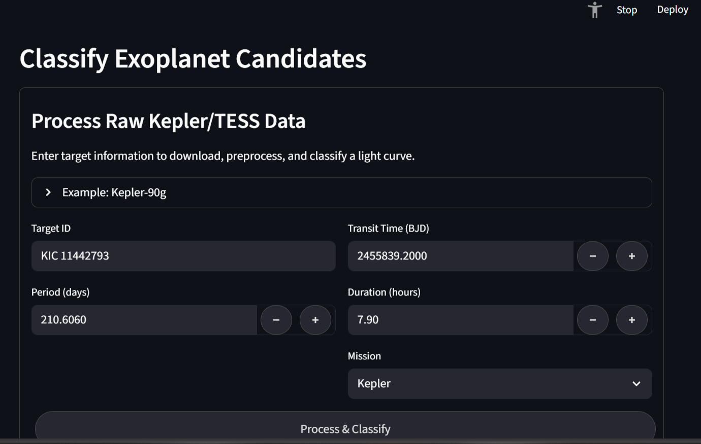
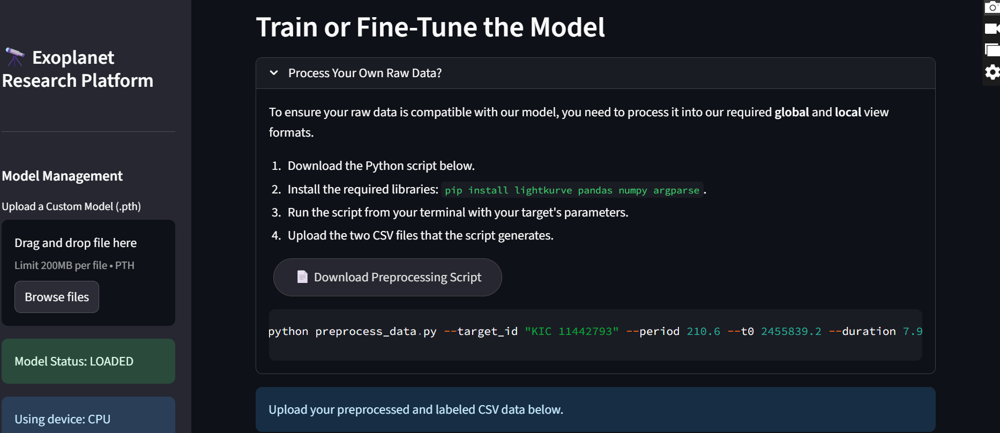
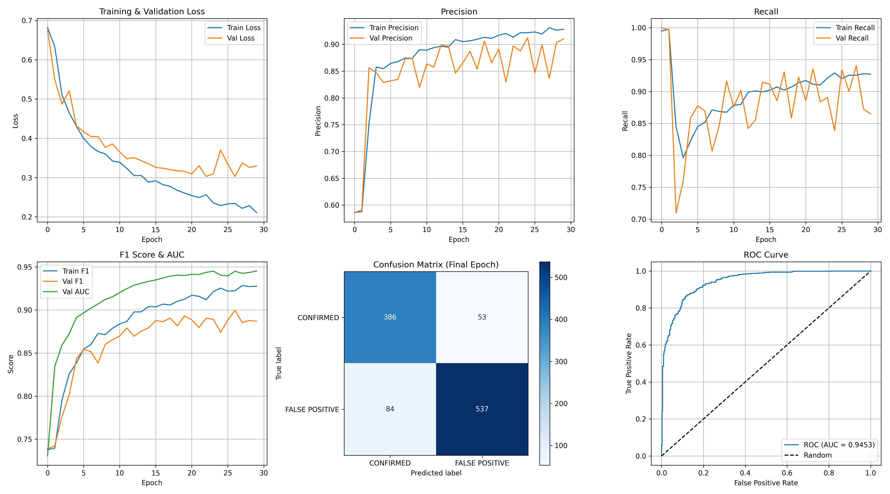
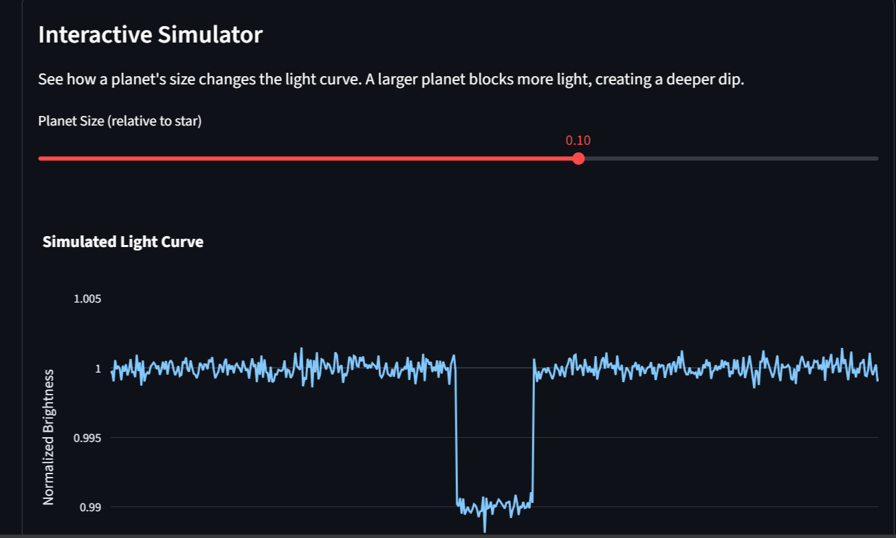
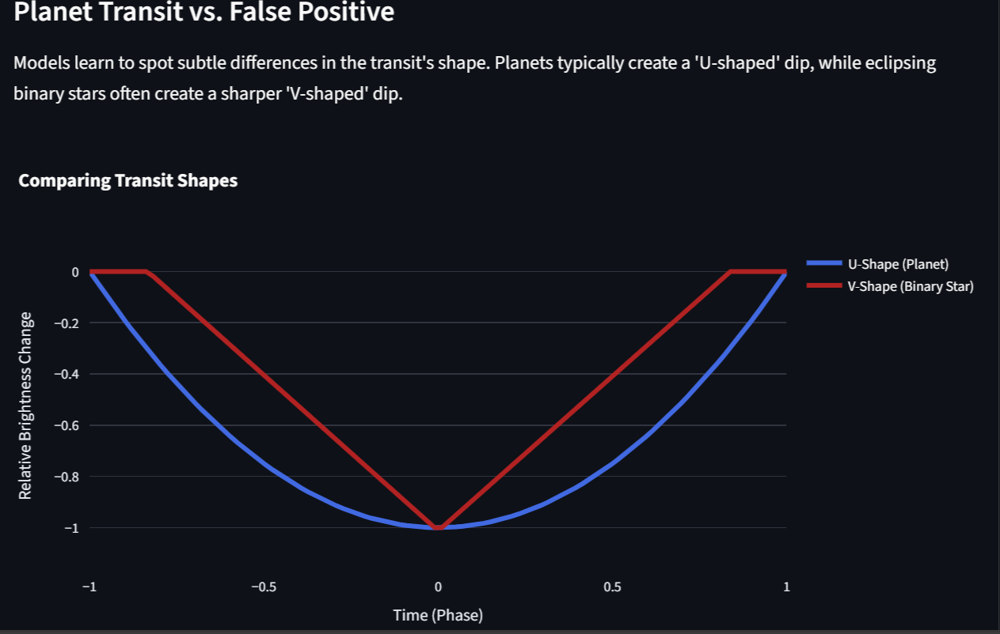

# Exoplanet Research Platform (EXOmniscient)🔭
A comprehensive deep learning application for discovering and classifying exoplanets using NASA Kepler and TESS telescope data. This platform leverages Convolutional Neural Networks (CNNs) to distinguish real planetary transits from false positives with high accuracy.

---

## Features

### 🎯 Real-Time Exoplanet Classification

Process raw light curve data directly from Kepler/TESS/K2 missions or upload preprocessed data for batch classification. The system automatically downloads, preprocesses, and analyzes transit signals to determine planetary probability with detailed confidence metrics.This Makes Planet never easier!!

**Key Capabilities:**
- Single target processing with automatic data retrieval
- Batch classification from preprocessed CSV files
- Interactive visualization of global and local transit views
- Confidence scoring with scientific context

---

### 🧠 Model Training & Fine-Tuning

Train new models from scratch or fine-tune existing ones with your own labeled datasets. Real-time training visualization with Plotly charts shows loss curves and validation metrics as they evolve.

**Key Capabilities:**
- Train new models or fine-tune pre-trained weights
- Configurable hyperparameters (epochs, batch size, learning rate, optimizer)
- Live training progress with interactive loss curves
- Comprehensive training summary reports
- Automatic model saving and download

---

### 📊 Dataset Analysis & Visualization

Explore training dataset statistics with dynamic visualizations comparing planetary signals versus false positives. Understand class distribution and average signal morphology.

**Key Capabilities:**
- Class distribution bar charts
- Average signal shape comparison (planets vs false positives)
- Sample count metrics
- Statistical summaries

---

### 🎓 Model Evaluation with Scientific Rigor

Assess model performance on held-out test sets with comprehensive metrics including accuracy, precision, recall, F1-score, and ROC-AUC. Generate confusion matrices and ROC curves for publication-quality analysis.

**Key Capabilities:**
- Complete performance metrics dashboard
- Confusion matrix heatmaps
- ROC curve visualization
- Downloadable evaluation reports
- Scientific rigor with unseen test data

---

### 📚 Educational Resources & Interactive Learning

Learn about the transit method, understand how machine learning aids exoplanet discovery, and explore the differences between planetary transits and false positives through interactive simulations.

**Key Capabilities:**
- Interactive light curve simulator
  
- Transit shape comparison (U-shape vs V-shape)
  
- Literature review of ML approaches (CNNs, classical ML, ensemble methods)
- Links to NASA datasets and resources
- Comprehensive explanations of detection methods

---
**Kepler Mission:**
        - [NASA Exoplanet Archive - Kepler](https://exoplanetarchive.ipac.caltech.edu/cgi-bin/TblView/nph-tblView?app=ExoTbls&config=cumulative)
        - [Kepler Confirmed Planets](https://exoplanetarchive.ipac.caltech.edu/cgi-bin/TblView/nph-tblView?app=ExoTbls&config=planets)
        
**K2 Mission:**
        - [K2 Candidates](https://exoplanetarchive.ipac.caltech.edu/cgi-bin/TblView/nph-tblView?app=ExoTbls&config=k2candidates)
        
  **TESS Mission:**
        - [TESS Candidates](https://exoplanetarchive.ipac.caltech.edu/cgi-bin/TblView/nph-tblView?app=ExoTbls&config=TOI)
        - [MAST TESS Data Archive](https://archive.stsci.edu/tess/)
        
  **Additional Resources:**
        - [Lightkurve Documentation](https://docs.lightkurve.org/)
        - [NASA Exoplanet Exploration](https://exoplanets.nasa.gov/)
        -Shallue, C. J., & Vanderburg, A. (2018). Identifying exoplanets with deep learning: A five-planet resonant chain           around Kepler-80 and an eighth planet around Kepler-90. The Astronomical Journal, 155(2), 94. https://doi.org/10.3847/1538-3881/aa9e09

